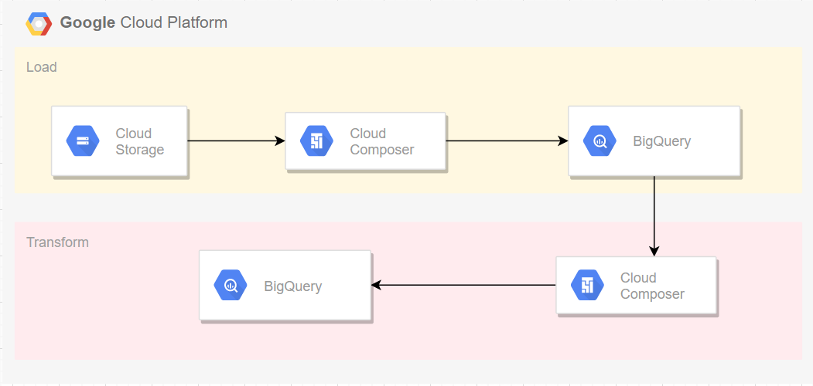

**Table of Contents**

- [About Solution](#about-solution)
- [Tool Decision](#tool-decision)
- [How to Run](#how-to-run)
  - [Inputs](#inputs)
  - [Outputs](#outputs)
  - [Environment Setup](#environment-setup)
  - [Troubleshooting](#troubleshooting)
  - [Validation](#validation)
- [Data Quality Issues and Considerations/Assumptions](#data-quality-issues-and-considerationsassumptions)
  

## About Solution
This is an airflow automated workflow to find profits 
for each add-on option sold along with a vehicle having a specific model. 
It uses two csv files as input one of which contains options sold 
for vehicle models and the other csv holds historical  
material cost for options built for models.

The solution uses Google Composer to load files into BigQuery, 
transforms tables using SQL query and creates a view for 
consumption by other systems.
See below diagram for data processing steps.

 

## Tool Decision 
This solution was implemented using airflow for two reasons:
1. Easy to orchestrate work that is executed on external systems 
such as BigQuery.
2. Airflow is one of the tools used by the organisation 
this solution was built for.
3. Data size assumed to be relatively small scale

## How to Run
### Inputs
* A csv file with _Base_dataset.csv_ file name and below schema:

| Field Name | Type |
|------------|------| 
| Vehicle_ID | INTEGER |	
| Option_Quantities	| INTEGER | 	
| Option_Code | STRING |
| Option_Desc | STRING |
| Model_Text | STRING |
| Sales_Price | INTEGER |

* A csv file with _Options_dataset.csv_ file name and below schema:

| Field Name | Type |
|------------|------| 
| Model | STRING |	
| Option_Code	| STRING | 	
| Option_Desc | STRING |
| Material_Cost | NUMERIC |

#### Location for inputs
Place two csv files in a bucket called _jlr-test-files_

### Outputs
Output location for this pipeline will be a BigQuery Dataset called _airflow_jlr_. 
To create the dataset, go to BigQuery and create dataset under the project 
you are working on, use defaults and put the number of days you would like your
tables to expire. 
 

### Environment Setup
In this solution Google Composer is used to run Airflow DAGs

* Go to Google Cloud Console and open [Composer](https://console.cloud.google.com/composer/environments?project=jlr-test-297613)
* If you haven't setup Composer already, create environment (may take up to half an hour)
* Once environment is created, go to the dags folder using the link in the environment list
for the composer instance you would like to use
* Upload _pipeline.py_ to dags folder
  * <bucket-name>/dags/pipeline.py
* Upload _variables_ folder to the root directory of the gcs bucket
  * <bucket-name>/variables/variables.json 
* Upload _tests_ folder to the root directory of the gcs bucket (not essential for dag run)
  * <bucket-name>/tests/test_pipeline.py
* Go to the environments page on Composer console and click on the link shown as 
Airflow webserver
* On the Airflow UI you will list of DAGs. Click on the dag named _composer_transform_
  * if you don't see above DAG name check if you have placed files correctly  
* Click on Trigger DAG to execute the DAG

After a a minute or so, depending on your data size, your workflow will be completed and
all squares will be shown as green.

### Troubleshooting

if any step in the dag run goes wrong you can view logs by clicking on the red square.
A pop up window will appear. Click on View logs button to see the logs and analyse what went wrong

### Validation

Once a successful execution is completed, you can navigate to BigQuery and check the dataset 
you had created. You should see a view called _vw_option_profit_ containing the base dataset
and two more columns; production_cost and profit.

## Data Quality Issues and Considerations/Assumptions

In the provided data sets a number of issues have been observed. 

* In the base data set sales price is null for Vehicle ID: 11933
* For some model&option pairs multiple material cost was found, 
hence average material cost is calculated
* Option code "1AT" was sold for free but has a material cost and should be noted.
* Options having zero or negative sales price are considerate to have zero cost and zero profit
